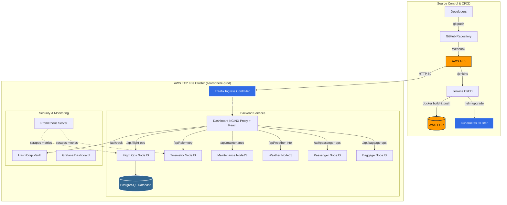

# AeroSphere Command – Global Autonomous Aviation Operations Platform

AeroSphere Command manages a worldwide aviation operations platform supporting commercial airlines, cargo operators, private aviation services, airports, maintenance organizations, and air traffic management agencies. 

This repository contains the cloud-native modernization initiative focused on infrastructure automation, continuous deployment, observability, and resilience.

## 🚀 Live Demo

You can view the live AWS deployment of the AeroSphere Platform here:
**[http://aerosphere-alb-dev-1534496399.ap-south-1.elb.amazonaws.com/](http://aerosphere-alb-dev-1534496399.ap-south-1.elb.amazonaws.com/)**

> **Note:** The platform includes paths for `/grafana/` (Observability), `/prometheus/` (Metrics), and the main React Dashboard.

## 🏗 System Architecture

The AeroSphere ecosystem is an advanced, highly-available DevOps platform. The following diagram illustrates the complete CI/CD, deployment, and observability architecture:

## 🛠 Technology Stack

This project implements a highly available DevOps ecosystem designed to satisfy strict aviation authority requirements:

- **Infrastructure Automation**: AWS Provisioned via HashiCorp Terraform (`infrastructure/`)
- **Containerization**: 6 distinct microservices containerized via Docker (`services/`)
- **Orchestration**: Kubernetes / K3s with Helm package management (`helm/`, `kubernetes/`)
- **CI/CD Pipeline**: Jenkins declarative pipelines with automatic GitOps webhook triggers (`Jenkinsfile`)
- **Observability**: Prometheus & Grafana stack configured via Helm (`monitoring/`)
- **Centralized Logging**: Elasticsearch & Kibana (ELK Stack) (`logging/`)
- **Security & Secrets**: HashiCorp Vault Integration (`vault/`)
- **Resilience**: Disaster recovery simulations using Kubernetes Chaos testing (`security/`)

## ✈️ Core Capabilities
* **Automated Rollouts:** Commits to `main` trigger a zero-downtime deployment pipeline.
* **Flight Operations Center:** Track real-time aviation telemetry, manage flight routes, and execute flight delays.
* **Disaster Recovery Controls:** Simulate high-level infrastructure failure (such as Telemetry server outages) to demonstrate Kubernetes Self-Healing mechanisms and graceful degradation.

## ⚙️ How to Deploy Locally
1. Ensure `aws-cli`, `terraform`, `docker`, and `kubectl` are installed.
2. Run `make cloud-up` to automatically provision AWS EC2, bootstrap the K3s cluster, and deploy all Helm charts.
3. Access the dashboard via the load balancer URL provided in your CLI output.
4. Run `make cloud-down` to safely tear down all infrastructure and prevent further AWS charges.
